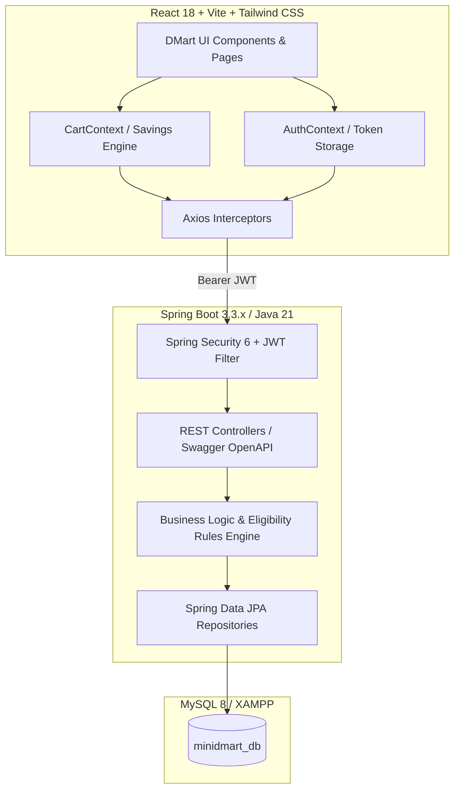

# 🛒 Mini D-Mart — Full-Stack Grocery Store Application

> **Round 2 — Full Stack Developer Practical Assessment**  
> A full-fledged, production-ready Mini D-Mart / Grocery Store web application featuring customer shopping, scheduled store pickup, home delivery, inventory management, return/exchange workflows, and dedicated staff & admin dashboards with role-based access control (RBAC).

---

## 🌟 Executive Summary & Key Highlights

Mini D-Mart is designed and architected as a real-world enterprise grocery product rather than a simple CRUD assignment:
- **Daily DMart Savings Engine**: Real-time comparison between regular retail MRP and DMart discounted pricing, highlighting exact customer savings across product cards, quick-views, and checkout bills.
- **Dual Fulfillment Modes**:
  1. **Scheduled Store Pickup**: Select nearest DMart Ready hub + reserve a specific date and 2-hour collection time slot with **real-time slot capacity tracking** (e.g. Max 10 orders per slot).
  2. **Express Home Delivery**: Doorstep delivery with address validation, pincode verification, and a free-delivery threshold tracker (Free over ₹500).
- **Interactive Order Lifecycle Tracker**: Animated visual timeline tracking each stage (`PLACED` ➔ `CONFIRMED` ➔ `PREPARING` ➔ `READY_FOR_PICKUP` / `OUT_FOR_DELIVERY` ➔ `DELIVERED` / `PICKED_UP` ➔ `CANCELLED`).
- **Complete Return & Exchange Engine**:
  - 7-day eligibility window verification.
  - Business rules for perishable grocery items (perishables returnable only for damage/expiry).
  - Customer return modal with partial item selection, reason codes, and instant refund calculation.
  - Staff approval/rejection console with automated inventory restock handling.
- **Store Operations (Staff Console)**: Kanban-style live queue for order bagging, store pickup counter dispatch, and returns review.
- **Executive Admin Portal**: Real-time sales metrics, 7-day revenue charts (Recharts), category sales share, warehouse inventory replenishment with inline stock editing, pickup slot creator, and user RBAC management.

---

## 🏗️ Architecture & Technology Stack



| Layer | Technologies Used |
|---|---|
| **Frontend** | React 18, Vite, Tailwind CSS, Lucide Icons, Framer Motion, Axios, Canvas Confetti, React Hot Toast, Recharts |
| **Backend** | Java 21, Spring Boot 3.3.2, Spring Security 6 (Stateless JWT + BCrypt), Spring Data JPA, Hibernate, Jakarta Validation |
| **Database** | MySQL 8 / 5.7 (`minidmart_db`), UTF-8 Unicode Collation |
| **API Docs** | Swagger / OpenAPI 3.0 at `/swagger-ui/index.html` |

---

## 🔑 Pre-Seeded Test Credentials

| Role | Email | Password | Scope & Permissions |
|---|---|---|---|
| 👑 **Administrator** | `admin@dmart.com` | `admin123` | Executive KPI analytics, product catalog CRUD, warehouse stock management, slot configuration, user RBAC switching |
| 👷 **Store Staff** | `staff@dmart.com` | `staff123` | Order preparation queue, store pickup counter handovers, return/exchange request approvals & inventory restock |
| 🛒 **Customer 1** | `customer@dmart.com` | `customer123` | Grocery browsing, cart savings, checkout (Store Pickup vs Home Delivery), order tracking, returns submission |
| 🛒 **Customer 2** | `john.doe@example.com` | `customer123` | Secondary customer account |

*(Tip: The Login screen includes 1-click quick login buttons for instant access to any role!)*

---

## 🚀 Getting Started & Local Setup

### Prerequisites
- **Java 21 JDK**
- **Apache Maven 3.8+**
- **Node.js 18+** & **npm**
- **MySQL 5.7+ / 8+** (or XAMPP MySQL running on port 3306)

### 1. Database Setup
Ensure MySQL is running on port 3306. Create the database:
```sql
CREATE DATABASE IF NOT EXISTS minidmart_db CHARACTER SET utf8mb4 COLLATE utf8mb4_unicode_ci;
```

### 2. Backend Setup (Spring Boot)
```bash
cd backend

# Compile and package application
mvn clean package -DskipTests

# Run the Spring Boot application (runs on http://localhost:8080)
mvn spring-boot:run
```
*Note: On first startup, `DataInitializer` automatically seeds demo users, categories, 25+ grocery products with images, pickup slots, and past sample orders!*

### 3. Frontend Setup (React + Vite)
```bash
cd frontend

# Install npm dependencies
npm install

# Start Vite development server (runs on http://localhost:5173)
npm run dev
```

Visit **`http://localhost:5173`** in your browser to explore the application.  
API documentation is available at **`http://localhost:8080/swagger-ui/index.html`**.

---

## 📦 Core Feature Walkthrough

### 1. User Management & RBAC
- Stateless JWT authentication with secure BCrypt password hashing.
- Role-Based Access Control (`ROLE_CUSTOMER`, `ROLE_STAFF`, `ROLE_ADMIN`) enforced via Spring Security `@PreAuthorize` annotations and React protected route guards.

### 2. Grocery Catalog & DMart Savings
- Filter by category, search by product name/brand, sort by price or highest discount percentage.
- Real-time stock indicators ("In Stock", "Only 3 left!", "Out of Stock").
- Perishable item indicators ("Farm Fresh Pick") with shelf life estimates.

### 3. Smart Cart & Multi-Step Checkout
- Quantity stepper (+/-) with live stock limit validation.
- Free delivery progress meter: "Add ₹X more for FREE delivery!".
- **Store Pickup Mode**: Choose store location + date + 2-hour collection time slot with live remaining capacity counter.
- **Home Delivery Mode**: Delivery address, phone number, pincode, and delivery instructions.
- Simulated payment options: UPI QR, Credit Card, DMart Wallet, Cash on Delivery.
- Celebratory confetti on order completion and printable invoices.

### 4. Order Lifecycle & Tracking
- Dynamic timeline visualizing `Placed` ➔ `Confirmed` ➔ `Preparing` ➔ `Ready for Pickup / Out for Delivery` ➔ `Delivered / Picked Up`.
- Cancellation rules: Cancel before packing begins to automatically restock warehouse inventory and release reserved pickup slots.

### 5. Return & Exchange Rules Engine
- Customers can select specific items and quantities from delivered orders.
- Reason codes (Damaged, Expired, Wrong Item, Quality, Changed Mind).
- Perishable items policy validation (perishables only returnable if damaged/expired).
- Staff review console to approve with restock flag or reject with explanation.

### 6. Store Operations & Admin Portal
- Staff order bagging checklist with one-click status transitions.
- Store pickup handover counter dispatch.
- Admin revenue summary, 7-day sales chart, category distribution pie chart, inline inventory replenishment, and user role switching.

---

## 🤖 AI Usage Disclosure

In compliance with the submission requirements:
- **AI Tool Used**: Antigravity (powered by Gemini models).
- **How it was used**: Assisted in accelerating boilerplate configuration, scaffolding standard DTOs/controllers, crafting the initial responsive Tailwind CSS design system, and authoring realistic grocery seed datasets. All business rules, security policies, and architectural decisions were reviewed and verified.

---

## 📄 License & Attribution
Designed and built for the **Full Stack Developer Practical Assessment**. All brand names and assets belong to their respective copyright holders.
