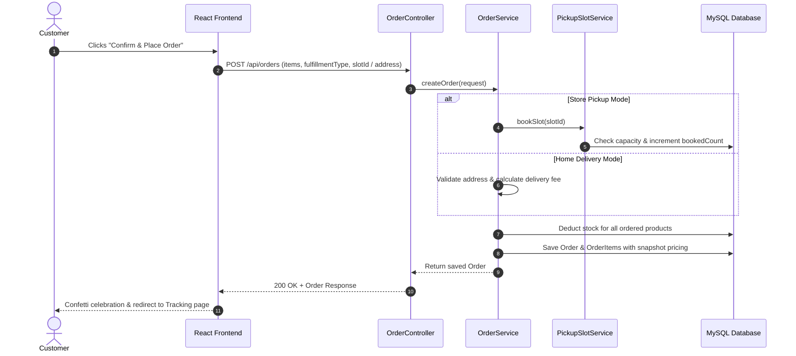
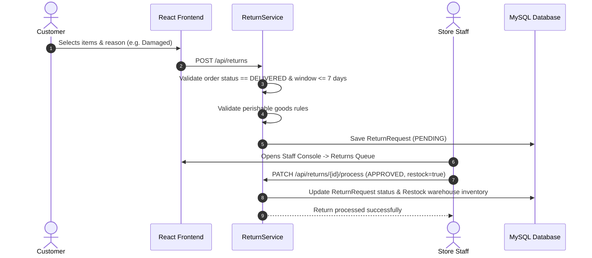

# 🏛️ Mini D-Mart — System Architecture & Design Document

## 1. System Architecture Overview

The application follows a clean 3-tier decoupled client-server architecture:

```
[ Client Layer (React 18 / Vite / Tailwind CSS) ]
                   │
                   ▼ (HTTPS / JSON REST APIs + JWT Auth)
[ Application Layer (Spring Boot 3 / Spring Security 6) ]
  ├── Security Filter Chain & Token Interceptor
  ├── REST Controllers (OpenAPI / Swagger)
  ├── Business Domain Services & Policy Engine
  └── Data Access Layer (Spring Data JPA / Hibernate)
                   │
                   ▼ (JDBC MySQL Driver)
[ Persistence Layer (MySQL 8 / XAMPP RDBMS) ]
```

---

## 2. Component Breakdown

### Frontend (Client Tier)
- **Vite & React 18**: Ultra-fast bundler and modern React component tree.
- **Tailwind CSS**: Custom DMart brand theme design tokens (`#0F8A5F` green, amber discount stickers, crisp slate layout).
- **Lucide Icons & Framer Motion**: Clean UI iconography and fluid transitions.
- **State Management**:
  - `AuthContext`: Centralized JWT token persistence, auto-refresh, and role authorization helpers (`isAdmin`, `isStaff`, `isCustomer`).
  - `CartContext`: Basket state synced to localStorage, real-time MRP discount calculations, delivery fee threshold progress, and quantity stepper logic.
- **Axios Interceptors**: Transparently attaches Bearer tokens and handles token expiration redirections.

### Backend (Application Tier)
- **Spring Boot 3.3.2**: Core framework offering dependency injection, web MVC, and data management.
- **Spring Security 6**: Stateless session security filter chain, BCrypt hashing, and `@EnableMethodSecurity` for granular RBAC.
- **Business Services**:
  - `OrderService`: Handles price calculations, stock deduction, slot booking, and cancellation rules.
  - `PickupSlotService`: Manages store locations, collection dates, and slot capacity limits.
  - `ReturnService`: Validates return eligibility windows (7-day rule, perishable item exceptions) and handles inventory restock logic.
  - `AnalyticsService`: Generates 7-day revenue trends, category distributions, and inventory replenishment alerts.

### Persistence (Data Tier)
- **MySQL Database (`minidmart_db`)**: Normalized relational schema with foreign key integrity constraints, indexing, and cascade rules.
- **Hibernate / JPA**: Entity-relational mapping with lazy/eager fetching strategies and transactional integrity (`@Transactional`).

---

## 3. Workflow Diagrams

### A. Order Placement Workflow (Store Pickup vs Home Delivery)


### B. Return & Exchange Lifecycle

