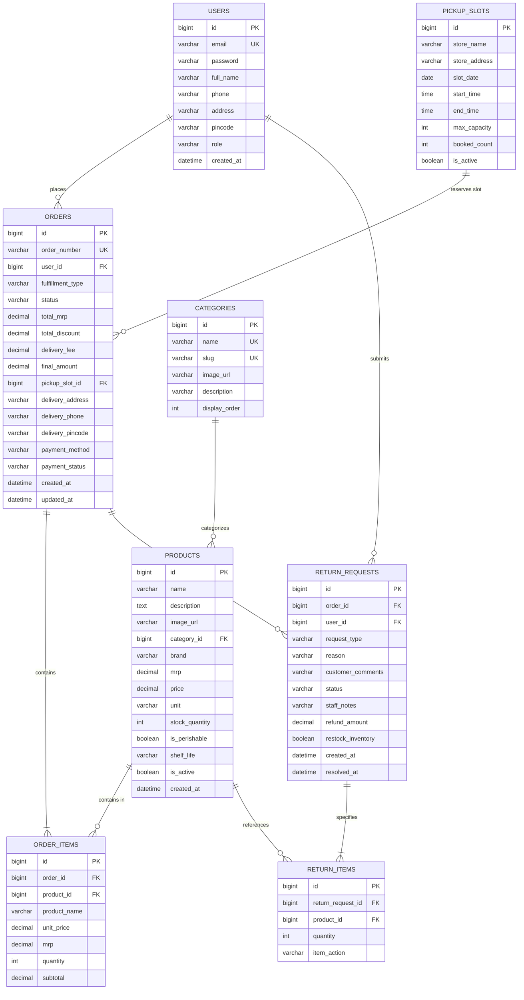

# 🗄️ Mini D-Mart — Database Schema & Entity Relational Model

## 1. Entity Relational Diagram (ERD)

---

## 2. Table Specifications & Constraints

### 1. `users`
Stores user credentials and RBAC roles.
- `email`: `VARCHAR(120) NOT NULL UNIQUE`
- `password`: `VARCHAR(255) NOT NULL` (BCrypt encoded)
- `role`: `VARCHAR(30) NOT NULL` (`ROLE_CUSTOMER`, `ROLE_STAFF`, `ROLE_ADMIN`)

### 2. `products`
Stores grocery product catalog, regular MRPs and discounted DMart prices.
- `mrp`: `DECIMAL(10,2) NOT NULL` (Standard retail MRP)
- `price`: `DECIMAL(10,2) NOT NULL` (Discounted DMart price)
- `stock_quantity`: `INT NOT NULL`
- `is_perishable`: `BOOLEAN NOT NULL` (Determines return eligibility)

### 3. `pickup_slots`
Manages 2-hour pickup collection windows at DMart Ready hubs.
- `max_capacity`: `INT NOT NULL` (Max orders allowed per slot)
- `booked_count`: `INT NOT NULL` (Tracked in real time)

### 4. `orders`
Represents customer purchase transactions.
- `order_number`: `VARCHAR(50) NOT NULL UNIQUE` (Format: `DM-YYYYMMDD-XXXX`)
- `status`: `VARCHAR(30)` (`PLACED`, `CONFIRMED`, `PREPARING`, `READY_FOR_PICKUP`, `OUT_FOR_DELIVERY`, `DELIVERED`, `PICKED_UP`, `CANCELLED`)
- `fulfillment_type`: `VARCHAR(30)` (`STORE_PICKUP` or `HOME_DELIVERY`)

### 5. `return_requests` & `return_items`
Manages customer return/exchange submissions, staff inspection notes, and inventory restock decisions.
